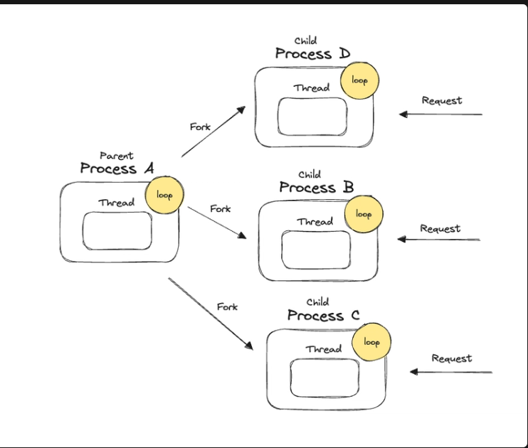

# Building a web server with Assembly x86

### Reference link
[Series](https://dev.to/leandronsp/construindo-um-web-server-em-assembly-x86-parte-i-introducao-14p5)

## History and more
> Writing computer programs involves manipulating finite memory and I/O data devices through instructions executed by the CPU.

Our program deals with memory manipulation everytime.
* Memory Hierarchy

1. Registers
2. CPU Cache
3. RAM
4. Mass storage device

The CPU does not only interacts with RAM but also with other storage devices managed by the computational system.

> Everything (or almost) is memory. (data or instructions)

The OS abstract a program's location in the memory hierarchy, freeing it from needing to know the physical implementation.

### CPU Clock
> To execute an instruction the CPU needs at least one clock cicle.

The decision about how many clock cycles an instruction takes is determined during CPU design.

| **Reminder**: Instructions live in memory.

**CPU timeline**

Search instruction in memory > decode > execute > storage output in memory  

### Registers
> Outputs from CPU are stored in something inside the CPU itself instead of main memory for a faster operation. **REGISTERS**. 

**Tradeoffs**
In the memory hierarchy, the closer a memory is to the CPU, the faster it can be accessed. However, this also means the memory is more volatile and has lower storage capacity.

Registers are components where the CPU stores instructions and data for the program being executed.

**ISA** - Instruction Set Architecture

### ISA
**CISC**
> Complex Instruction Set Computing

**RISC**
> Reduced Instruction Set Computing, architecture designed with simpler and fewer instructions, resulting in fewer CPU clock cycles. 

Fixed length instructions: Faster and predictable performance.

> ARM is **RISC**.

* x86 is a "fake-CISC" architecture because of adaptations to support operations found in RISC architecture.

## About Computer Programs
To resolve concurrency issues in memory access or output between program instructions, we need to isolate them from other programs by grouping them.

> One of the OS roles and a concept: processes.

Every program is encapsulated in a process that has its own virtual space in main memory.

### Opcodes
> x64 defines a set of **opcodes** that represent the available instructions, registers, etc.

### Endianness
> Property to define bit significance.

**Little endian vs Big endian**

## Hello, World!
Next, write a programa that outputs the classic "Hello, World".

* Allocate memory for "Hello, World" string
* Write the string in the output STDOUT
* Exit the program

### ASCII
```
H: 0x48     
e: 0x65     
l: 0x6C     
l: 0x6C     
o: 0x6F
,: 0x2C

W: 0x57
o: 0x6F
r: 0x72
l: 0x6C
d: 0x64
```
> 0x is a notation to indicate that the number after *x* it's a hexadecimal.

## Syscalls
Compilation of syscalls for linux:

[System calls table](https://x64.syscall.sh/)

Linux Kernel was written in C, thus all system calls are declared in C.

[System calls manual in C](https://man7.org/linux/man-pages/index.html)

## Assembly
### Mnemonics
> A textual form that represents information in a way that makes it easier for the human brain to memorize.

```
BF 01 00 00 00 = MOV RDI, 1
```

But the CPU doesn't understand this language directly, so we use an assembler to convert mnemonics into machine code again.

### Assemblers
Many assemblers were built for different architectures throughout the years.

**For this project:**
* x86_64 (x64)
* GNU/Linux (Ubuntu)
* Assembler NASM 2.16.01
* GNU ld 2.38
* Debugger GNU gdb 12.1
* strace 5.16 (syscalls tracing)

**Timeline**

mnemonics -> assembler -> machine code

To compile the program, mount the instructions with NASM:

```
nasm -f elf64 first_program.asm -o first_program.o
```

* -f elf64: destiny arch
* first_program.asm: input file
* first_program.o: output for file XPTO

> .o file contains the machine code generated by the assembler or compiler.

But this file isn't the executable yet!!!

This file can be, if needed, linked with other `.o` files

### Linker
> Linker is this program responsible for generating a final executable file with machine code using one or more object files.

```
ld first_program.o -o first_program
```

> Last run process code: $? 

### Debug
**Program size**:
```
size first_program
```

Output:
```
   text    data     bss     dec     hex filename
     12       0       0      12       c first_program
```

Each program in the OS is divided by sections:

* text: it contains the program's code. The OS needs to search this section in main memory.
* data: section of initialized data in memory
* bss: section of not-initialized data in memory
* `dec` and `hex` are just the byte size representation

The linker adds headers to the program for OS admission of the executable

### GDB
```
nasm -g -f elf64 hello.asm -o hello.o
```

> `-g` adds gdb debbuger symbols

Output:
```
first_program  :
section           size       addr
.text              0xc   0x401000
.debug_aranges    0x30        0x0
.debug_info       0x73        0x0
.debug_abbrev     0x1d        0x0
.debug_line       0x45        0x0
Total            0x111
```

Enter in GDB environment
```
gdb --quiet
```

### Strace
Track syscalls and signals
```
strace first_program
```

To run strace we need to load the symbols using `file` command:
```
strace ./first_program
```

### Memory Layout
The program grows in this direction of memory sections:
```
text -> data -> bss
```
> The text section needs to be located near the lowest memory addresses (0x401000)

### RFLAGS

> Store conditional opcodes

```
[ PF ZF IF ]
```

* **interrupt flag**: determine whether the program can receive hardware interrupts.
* **parity flag**: indicatres if the numbers of set bits is odd or even in the binary representation of the result of the last operation
* **zero flag**: added when a arithmetic operation results in zero for any registers

When reading 8 byte blocks in the stack (rsp), we can navigate through every ARG available for the program
```
x /8xb $rsp + 8 (+ 16....)
```

### Registers purpose


## Web Architecture
| To finally create a web server, we need to handle HTTP messages transmitted over transport layer (TCP) through a network

### Client-Server

> Note to myself: That's what I found interesting about this article series, in this section the author, quoting: "...How the entire network communication model (OSI) can be translated in something pratical whitin an OS"

### Sockets and TCP
> Client and Server both have a process running in with a PID

We know that is possible to make two processes in a machine communicate with each other through UNIX sockets (GNU/Linux systems)

**Berkeley Sockets**

TCP communicates using sockets

In this case...

### How a web server works
**4 syscalls**:

* socket - creates a network communication endpoint
* bind - assign name and port to the new socket
* listen - marks the new socket to be available for connections (must be of stream type, TCP)
* accept - accepts a client connection on the socket and creates a new *connection socket* for that client

> The server side will first create a socket, bind it to a well know local address, and put the socket in listening mode.

```
int socket(int domain. int type, int protocol)
```

* **domain**: Comunication domain. In the code sample, AF_INET = IPv4 = 2
* **type**: The code sample uses SOCK_STREAM, that is sequential, reliable, duplex and connection based
* **protocol**: The code sample uses 0 as default for AF_INET and SOCK_STREAM (socket TCP)

```
int bind(int sockfd, const struct sockaddr *addr, socklen_t addrlen)
```

* **sockfd**: Int that represents the descriptor for the new socket 
* **sockaddr \*\*addr\***: Pointer to the memory address that holds a data structure with the format below:
  * family
  * port
  * ip_address
  *sin_zero
* **addrlen**: 16 bytes, as the size of the data strcuture in x64 architectures

> The internet uses big-endian, caution when arranging the bytes order for port number

```
int listen(int sockfd, int backlog);
```
* **backlog**: Defines the maximum length to which the queue of pending connections for the socket may grow.

```
int accept(int sockfd, struct *addr, int addrlen, int flags)
```

> accept() is the waiter bringing a customer (who's ready to order) to a table


## Multi-threading
> The desired state for a server is to scale up the throughput without increasing latency (total time between request and response / client/server).

### Simulating bulk request
with **xargs**;

`xargs` takes input and passes it as arguments to another command

```
time echo {1..10} | xargs -n1 bash -c "time curl localhost:3000"
```

-P represents simultaneously requests
```
-P10
```

### Forking
To enable concurrency, it's important to know that every computer program runs whitin a OS process. 
However the actual execution occurs inside a thread (OS execution unity).

> *A forking creates a child process copying everything from the main program*


